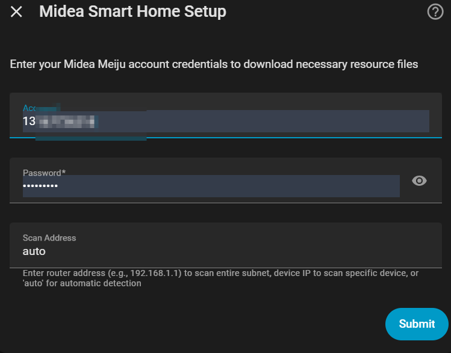

# Midea Smart Home

English | [简体中文](README_hans.md)

[![GitHub Release][releases-shield]][releases]
[![GitHub Activity][commits-shield]][commits]
[![License][license-shield]](LICENSE)
[![hacs][hacsbadge]][hacs]

Home Assistant custom integration for Midea smart devices via local network.

## Features

- **Local Control**: Devices are controlled directly via local network, no cloud connection required
- **Multi-Cloud Platform Support**: Support Midea MSmart Home, Midea Air, NetHome Plus, Ariston Clima and more cloud platforms
- **Auto Protocol Download**: Automatically download Lua protocol scripts from cloud (first-time setup only)
- **Flexible Configuration**: Support customizing entity attributes through device mapping files, easy to adapt new devices
- **Multi-language Support**: Support Chinese and English interface
- **Rich Entity Platforms**: Support climate, sensor, switch, select, button, number, vacuum, binary_sensor, fan, humidifier, light, cover, water_heater
- **Device Status Notifications**: Display device online/offline status notifications in Home Assistant sidebar

## Workflow

**Configuration Phase**
1. User enters account credentials (supports multiple cloud platforms)
2. Select the appropriate cloud server based on your app and region
3. Login to Cloud API

**Discovery Phase**
1. Get device details from cloud (Device ID, Model, SN8, etc.)
2. Auto-download Lua protocol file for the device
3. Scan device IP address in local network
4. Get device Token and Key for V3 protocol devices (not required for V1/V2)

**Runtime Phase**
1. Connect to device via local network
2. Parse device protocol using Lua script
3. Most devices receive status updates via callback push; special devices (e.g. 0xD9 Twin Tub Washer) use periodic polling
4. User commands sent directly to device (no cloud needed)

## Requirements

- **Home Assistant** >= 2025.12.4

## Installation

### One-Click Install (Recommended)

### HACS (Custom Repository)

1. Open HACS in Home Assistant
2. Go to "Integrations"
3. Click the "+" button (top right)
4. Click "⚙️ Custom repositories" (3 dots menu > Custom repositories)
5. Enter: `https://github.com/Cyborg2017/midea_smart_home`
6. Category: **Integration**
7. Click "Add"
8. Search for "Midea Smart Home" and click "Download"

### Manual Installation

1. Copy the `custom_components/midea_smart_home` directory to your Home Assistant `custom_components` folder
2. Restart Home Assistant
3. Go to Settings > Devices & Services
4. Click "Add Integration"
5. Search for "Midea Smart Home"

## Configuration

For detailed configuration guide, please see [Configuration Guide](GUIDE.md)

## Supported Devices

| No. | Code | Device Type |
|-----|------|-------------|
| 1 | 0x17 | Drying Rack |
| 2 | 0x26 | Bath Heater |
| 3 | 0x9C | Integrated Stove |
| 4 | 0xA1 | Dehumidifier |
| 5 | 0xAC | Floor Air Conditioner / Wall Air Conditioner / Central Air Conditioner / Central Fresh Air / Central Miniaturized Fresh Air |
| 6 | 0xB0 | Microwave Oven |
| 7 | 0xB6 | Range Hood |
| 8 | 0xB8 | Smart Robot Vacuum |
| 9 | 0xBF | Microwave Steam Oven |
| 10 | 0xC2 | Smart Toilet |
| 11 | 0xCA | Multi-Door Fridge |
| 12 | 0xD9 | Twin Tub Washing Machine |
| 13 | 0xDA | Top Load Washing Machine |
| 14 | 0xDB | Cylinder Washing Machine |
| 15 | 0xDC | Clothes Dryer |
| 16 | 0xE1 | Dishwasher |
| 17 | 0xE2 | Electric Water Heater |
| 18 | 0xE3 | Gas Water Heater |
| 19 | 0xE6 | Gas Wall Hanging Stove |
| 20 | 0xEA | Rice Cooker |
| 21 | 0xED | Net Drinking Machine / Water Purifier / Pipeline Machine |
| 22 | 0xFA | Electric Fan |
| 23 | 0xFB | Electric Heater |
| 24 | 0xFC | Air Purifier |
| 25 | 0xFD | Humidifier |

> More device types are being adapted. Contributions are welcome!

## Credits

This project uses/references some code from:
- [midea_auto_cloud](https://github.com/sususweet/midea_auto_cloud)
- [midea_ac_lan](https://github.com/wuwentao/midea_ac_lan)
- [midea-local](https://github.com/midea-lan/midea-local)

[commits-shield]: https://img.shields.io/github/commit-activity/y/Cyborg2017/midea_smart_home.svg?style=for-the-badge
[commits]: https://github.com/Cyborg2017/midea_smart_home/commits/main
[hacs]: https://github.com/hacs/integration
[hacsbadge]: https://img.shields.io/badge/HACS-Custom-orange.svg?style=for-the-badge
[license-shield]: https://img.shields.io/github/license/Cyborg2017/midea_smart_home.svg?style=for-the-badge
[releases-shield]: https://img.shields.io/github/release/Cyborg2017/midea_smart_home.svg?style=for-the-badge
[releases]: https://github.com/Cyborg2017/midea_smart_home/releases
